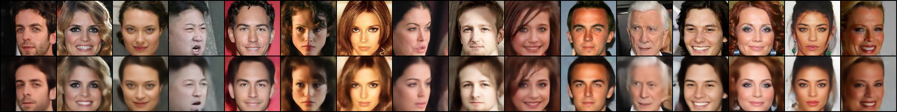

# autoencoder
code in train.py
The input passes through <half_dim/enc_depth> conv layers with stride=2, each shrinks the input by 4. Then, it passes through a fully connected layer (which is implemented as a conv layer with full kernel size) to a latent vector, and from there passes through each of the mentioned layers, but transposed, in reverse order.

